# Wasiat Online - Solana Program

A Solana program built with Anchor Framework for managing digital wills and automated crypto inheritance.

## 📋 Overview

This program provides comprehensive functionality for:

- **Digital Will Creation**: Testators can create will contracts with beneficiaries and heartbeat periods
- **Asset Deposits**: Supports SOL, SPL Tokens, and NFTs
- **Heartbeat System**: Verifies testator activity with configurable timers
- **Automatic Triggering**: Keeper service monitors and triggers expired wills
- **Asset Claims**: Beneficiaries can claim assets after wills are triggered
- **Asset Withdrawals**: Testators can withdraw assets before wills are triggered

## 🏗️ Architecture

```mermaid
graph TB
    subgraph "Solana Program Layer"
        A[📜 Wasiat Online Program] --> B[🏦 PDA Vaults]
        A --> C[⚙️ Global Config]
        A --> D[💰 Fee Vault]
    end

    subgraph "Core Instructions"
        E[📝 Create Will] --> A
        F[💓 Send Heartbeat] --> A
        G[🤖 Trigger Will] --> A
        H[🎯 Claim Assets] --> A
        I[💼 Withdraw Assets] --> A
    end

    subgraph "Asset Management"
        J[💎 SOL] --> B
        K[🪙 SPL Tokens] --> B
        L[🖼️ NFTs] --> B
    end
```



## 📁 Project Structure

```
anchor/
├── programs/wasiat-online/          # Main program
│   ├── src/
│   │   ├── lib.rs                   # Program entry point
│   │   ├── constants.rs             # Program constants
│   │   ├── error.rs                 # Error handling
│   │   ├── instructions/            # All program instructions
│   │   │   ├── mod.rs               # Module exports
│   │   │   ├── initialize.rs        # Program initialization
│   │   │   ├── create_will.rs       # Create new will
│   │   │   ├── deposit_sol.rs       # Deposit SOL to vault
│   │   │   ├── deposit_spl_token.rs # Deposit SPL tokens
│   │   │   ├── deposit_nft.rs       # Deposit NFTs
│   │   │   ├── send_heartbeat.rs    # Send heartbeat
│   │   │   ├── trigger_will.rs      # Trigger expired will
│   │   │   ├── claim_sol.rs         # Claim SOL
│   │   │   ├── claim_spl_token.rs   # Claim SPL tokens
│   │   │   ├── claim_nft.rs         # Claim NFTs
│   │   │   ├── withdraw_sol.rs      # Withdraw SOL
│   │   │   └── update_config.rs     # Update configuration
│   │   └── state/                   # Data structures
│   │       ├── mod.rs               # State module exports
│   │       ├── will.rs              # Will account structure
│   │       └── config.rs            # Config account structure
├── tests/                           # Test files
├── migrations/                      # Deployment scripts
├── Anchor.toml                      # Anchor configuration
├── Cargo.toml                       # Rust dependencies
├── package.json                     # Node.js dependencies
└── tsconfig.json                    # TypeScript config
```

## 🚀 Quick Start

### Prerequisites

- **Rust**: 1.70+
- **Solana CLI**: Latest version
- **Anchor CLI**: 0.31.1+
- **Node.js**: 18+
- **pnpm**: Package manager

### Installation

```bash
# Clone repository
git clone <repository-url>
cd wasiat-online/anchor

# Install dependencies
pnpm install

# Build program
anchor build

# Run tests
anchor test
```

### Development

```bash
# Start local validator
solana-test-validator

# In another terminal, run tests
anchor test

# Build program
anchor build

# Deploy to localnet
anchor deploy
```

## 🔧 Configuration

### Anchor.toml

```toml
[toolchain]
anchor_version = "0.31.1"
package_manager = "pnpm"

[programs.devnet]
wasiat_online = "6rs8fcHe8R5xFM56LyaEHGnxjt5QQcrVZWsMbDphQpe4"

[provider]
cluster = "devnet"
wallet = "/path/to/your/keypair.json"
```

### Environment Setup

```bash
# Set Solana cluster
solana config set --url https://api.devnet.solana.com

# Set keypair
solana config set --keypair /path/to/your/keypair.json

# Check configuration
solana config get
```

## 📚 Program Instructions

### Core Functions

| Instruction      | Description                    | Access Control |
| ---------------- | ------------------------------ | -------------- |
| `initialize`     | Initialize program and config  | Admin only     |
| `create_will`    | Create new will                | Testator       |
| `send_heartbeat` | Reset heartbeat timer          | Testator       |
| `trigger_will`   | Trigger expired will           | Keeper/Anyone  |
| `claim_*`        | Claim assets (SOL/SPL/NFT)     | Beneficiary    |
| `withdraw_*`     | Withdraw assets before trigger | Testator       |
| `update_config`  | Update program configuration   | Admin only     |

### Asset Support

- **💎 SOL**: Native Solana token
- **🪙 SPL Tokens**: All SPL token standards
- **🖼️ NFTs**: Non-fungible tokens (Metaplex)

## 🗄️ Data Structures

### Will Account

```rust
#[account]
pub struct Will {
    pub testator: Pubkey,           // Asset owner
    pub beneficiary: Pubkey,        // Inheritance recipient
    pub vault: Pubkey,              // PDA vault for assets
    pub heartbeat_period: i64,      // Heartbeat period (seconds)
    pub status: WillStatus,         // Will status
    pub created_at: i64,            // Creation timestamp
    pub last_heartbeat: i64,        // Last heartbeat timestamp
    pub triggered_at: Option<i64>,  // Trigger timestamp
    pub bump: u8,                   // PDA bump
    pub vault_bump: u8,             // Vault PDA bump
    pub reserved: [u8; 64],         // Reserved for upgrades
}
```

### Will Status

```rust
pub enum WillStatus {
    Created,    // 0 - Just created, no assets yet
    Active,     // 1 - Assets present, heartbeat active
    Triggered,  // 2 - Timer expired, can be claimed
    Claimed,    // 3 - Already claimed by beneficiary
    Withdrawn,  // 4 - Assets withdrawn by testator
}
```

### Global Config

```rust
#[account]
pub struct GlobalConfig {
    pub authority: Pubkey,          // Admin authority
    pub fee_vault: Pubkey,          // Fee vault
    pub token_fee_bps: u16,         // Fee in basis points
    pub nft_fee_lamports: u64,      // Flat fee for NFTs
    pub min_heartbeat_period: u32,  // Minimum period
    pub max_heartbeat_period: u32,  // Maximum period
    pub paused: bool,               // Emergency pause
    pub bump: u8,                   // PDA bump
    pub reserved: [u8; 32],         // Reserved space
}
```

## 🔐 Security Features

### PDA (Program Derived Address)

- **Will Account**: `["will", testator.key(), beneficiary.key()]`
- **Vault PDA**: `["vault", will_account.key()]`
- **Config PDA**: `["config"]`
- **Fee Vault**: `["fee_vault"]`

### Access Control

- **Testator**: Can only access their own wills
- **Beneficiary**: Can only claim after trigger
- **Admin**: Can only update config and pause program
- **Keeper**: Can trigger expired wills

### Validation

- **Heartbeat Period**: Must be within allowed range
- **Asset Balance**: Validate balance before operations
- **Status Check**: Validate will status before operations
- **Fee Calculation**: Automatically deduct fees during claims

## 🧪 Testing

### Run Tests

```bash
# Run all tests
anchor test
```

## 🚀 Deployment

### Build Program

```bash
# Build for development
anchor build

# Build for production
anchor build --release
```

### Deploy to Devnet

```bash
# Deploy program only
anchor deploy --program-keypair ~/.config/solana/program-keys/wasiat_online-keypair.json

# Initialize program after deployment
anchor run deploy

# Deploy and initialize in one command (recommended)
pnpm run dev-deploy

# Verify deployment
solana program show 6rs8fcHe8R5xFM56LyaEHGnxjt5QQcrVZWsMbDphQpe4
```

### Program Initialization

After deploying the program, you need to initialize it with configuration:

```bash
# Initialize program with default config
anchor run deploy
```

The initialization script will:

- Create global config PDA
- Create fee vault PDA
- Set default parameters (2.5% token fee, 0.001 SOL NFT fee)
- Use wallet from Anchor.toml as authority

**Important PDAs created:**

- Config PDA: `G8gnTaaHJ73NcpgUB9FmtuGc7dhASBGBUynNuYBPBBgs`
- Fee Vault PDA: `DZdbVLT1s55DuUQXGcQwjy9Jnm9NMkdm7Rg8x6mWQoK9`

### Deploy to Mainnet

```bash
# Update cluster to mainnet
solana config set --url https://api.mainnet-beta.solana.com

# Deploy with mainnet keypair
anchor deploy --program-keypair ~/.config/solana/program-keys/wasiat_online-keypair.json
```

### Health Checks

```bash
# Check program health
solana program show <PROGRAM_ID>

# Check account info
solana account <ACCOUNT_ADDRESS>

# Check recent transactions
solana logs <PROGRAM_ID>
```

## 🔧 Development Commands

### Useful Commands

```bash
# Deploy and initialize program (development)
pnpm run dev-deploy

# Format code
pnpm run lint:fix

# Check formatting
pnpm run lint

# Clean build artifacts
anchor clean

# Update dependencies
cargo update

# Check for outdated packages
pnpm outdated
```

### Debug Mode

```bash
# Run with debug logging
RUST_LOG=debug anchor test

# Check program logs
solana logs <PROGRAM_ID> --follow
```

## 🐛 Troubleshooting

### Common Issues

**Build Errors:**

```bash
# Clean and rebuild
anchor clean
anchor build
```

**Test Failures:**

```bash
# Check Solana version
solana --version

# Check Anchor version
anchor --version

# Run with verbose
anchor test --verbose
```

**Deployment Issues:**

```bash
# Check cluster status
solana cluster-version

# Verify keypair
solana-keygen verify <KEYPAIR_PATH>
```

## 📚 Documentation

### Related Docs

- [🏗️ System Architecture](../docs/ARCHITECTURE.md)
- [🗄️ Database Schema](../docs/DATABASE_SCHEMA.md)
- [🛣️ Development Roadmap](../docs/ROADMAP.md)
- [🎨 Frontend Design](../docs/FRONTEND_DESIGN.md)
- [🔧 Backend Service](../backend/README.md)

### API Reference

- **Solana Program**: [Program IDL](./target/idl/wasiat_online.json)
- **Client SDK**: [@coral-xyz/anchor](https://coral-xyz.github.io/anchor/)
- **Solana Web3**: [@solana/web3.js](https://solana-labs.github.io/solana-web3.js/)
