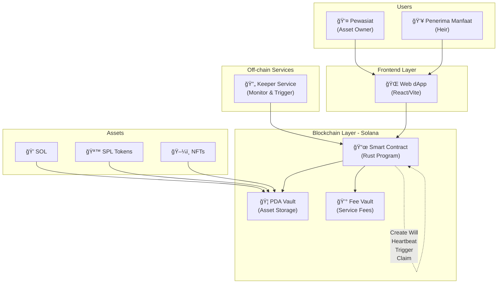

# System Architecture

Dokumentasi lengkap arsitektur sistem Wasiat Online yang menjelaskan komponen utama, alur kerja, dan interaksi antar sistem.

## System Architecture Diagram



## Architecture Overview

Sistem terdiri dari 3 layer utama:

```
┌─────────────────┐    ┌──────────────────┐    ┌─────────────────┐
│   React dApp    │────│   Go Backend     │────│  Solana Program │
│  - UI/UX        │    │  - REST API      │    │  - Smart Logic  │
│  - Wallet       │    │  - Keeper Service│    │  - Asset Storage│
└─────────────────┘    │  - SQLite DB     │    └─────────────────┘
                       └──────────────────┘
```

- **Frontend**: Interface untuk pewasiat dan penerima manfaat
- **Backend**: API layer + monitoring service untuk trigger otomatis
- **Blockchain**: Core logic + asset storage yang terdesentralisasi

## Workflow Diagram

```mermaid
flowchart TD
    Start([👤 Pewasiat Mulai]) --> CreateWill[📝 Buat Kontrak Wasiat]
    CreateWill --> SetBeneficiary[👥 Tentukan Penerima Manfaat]
    SetBeneficiary --> SetHeartbeat[⏰ Set Timer Heartbeat<br/>ex: 90 hari]
    SetHeartbeat --> DepositAssets[💰 Setor Aset ke Vault<br/>SOL/SPL/NFT]

    DepositAssets --> ActiveWill{📋 Wasiat Aktif}
    ActiveWill --> Heartbeat[💓 Kirim Heartbeat]
    Heartbeat --> ResetTimer[🔄 Reset Timer ke 90 hari]
    ResetTimer --> ActiveWill

    ActiveWill --> TimerExpired{⏳ Timer Habis?<br/>90 hari tanpa heartbeat}
    TimerExpired -->|Tidak| ActiveWill
    TimerExpired -->|Ya| KeeperTrigger[🤖 Keeper Mendeteksi<br/>& Trigger Wasiat]

    KeeperTrigger --> TriggeredState[🚨 Status: TRIGGERED]
    TriggeredState --> BeneficiaryNotified[📢 Penerima Manfaat<br/>Dapat Mengklaim]

    BeneficiaryNotified --> ClaimAssets[🎯 Klaim Aset]
    ClaimAssets --> VerifyIdentity[✅ Verifikasi Identity<br/>Penerima Manfaat]
    VerifyIdentity --> DeductFee[💸 Potong Biaya Layanan]
    DeductFee --> TransferAssets[📤 Transfer Aset<br/>ke Penerima Manfaat]
    TransferAssets --> Complete([✅ Selesai])

    %% Withdrawal path
    ActiveWill --> Withdraw[💼 Pewasiat Tarik Aset]
    Withdraw --> VerifyTestator[🔐 Verifikasi Pewasiat]
    VerifyTestator --> ReturnAssets[📥 Kembalikan Aset]
    ReturnAssets --> WillCancelled([❌ Wasiat Dibatalkan])

    style Start fill:#e1f5fe
    style Complete fill:#e8f5e8
    style WillCancelled fill:#ffebee
    style TriggeredState fill:#fff3e0
    style ActiveWill fill:#f3e5f5
```



## State Machine


## Sequence Diagram

```mermaid
sequenceDiagram
    participant T as 👤 Pewasiat
    participant W as 🌐 Web dApp
    participant P as 📜 Smart Contract
    participant V as 🏦 Vault
    participant K as 🤖 Keeper
    participant B as 👥 Penerima Manfaat
    participant F as 💰 Fee Vault

    Note over T,F: 1. Pembuatan Wasiat
    T->>W: Buka aplikasi
    T->>W: Input data wasiat<br/>(beneficiary, heartbeat period)
    W->>P: create_will()
    P->>V: Buat PDA Vault
    P-->>W: Will ID & Vault Address
    W-->>T: Konfirmasi wasiat dibuat

    Note over T,F: 2. Pendanaan Aset
    T->>W: Deposit aset (SOL/SPL/NFT)
    W->>P: deposit_assets()
    P->>V: Transfer aset ke vault
    P-->>W: Konfirmasi deposit
    W-->>T: Aset tersimpan

    Note over T,F: 3. Aktivitas Heartbeat
    loop Setiap < 90 hari
        T->>W: Klik tombol heartbeat
        W->>P: send_heartbeat()
        P->>P: Reset timer
        P-->>W: Timer direset
        W-->>T: Heartbeat berhasil
    end

    Note over T,F: 4. Trigger Otomatis
    K->>P: Cek semua wasiat
    K->>P: heartbeat_expired?
    P-->>K: Ya, timer habis
    K->>P: trigger_will()
    P->>P: Set status = TRIGGERED
    P-->>K: Status diubah

    Note over T,F: 5. Klaim Aset
    B->>W: Cek status wasiat
    W->>P: get_will_status()
    P-->>W: Status: TRIGGERED
    W-->>B: Dapat mengklaim aset
    B->>W: Klik klaim aset
    W->>P: claim_assets()
    P->>V: Ambil semua aset
    P->>F: Transfer biaya layanan
    V->>B: Transfer aset ke beneficiary
    P-->>W: Klaim berhasil
    W-->>B: Aset diterima
```



## Component Details

### Frontend Layer

- **React dApp**: User interface built with React Router v7
- **Wallet Integration**: Supports major Solana wallets (Phantom, Solflare, etc.)
- **Responsive Design**: Works on desktop and mobile devices

### Backend Layer

- **Go REST API**: High-performance API server
- **Keeper Service**: Automated monitoring and triggering
- **SQLite Database**: Lightweight database for off-chain data

### Blockchain Layer

- **Anchor Program**: Smart contract written in Rust
- **PDA Vaults**: Program Derived Addresses for secure asset storage
- **Fee Collection**: Automated service fee deduction

## Security Considerations

1. **Private Key Control**: Users maintain full control of their private keys
2. **Smart Contract Logic**: All critical logic executed on-chain
3. **PDA Security**: Assets secured by program-controlled accounts
4. **Keeper Redundancy**: Multiple keeper instances for reliability
5. **Emergency Pause**: Admin ability to pause system in emergencies

## Scalability

- **Solana Performance**: High throughput, low latency blockchain
- **Efficient Storage**: Optimized account structures (~200 bytes per will)
- **Keeper Optimization**: Efficient batch processing of triggers
- **Database Indexing**: Optimized queries for fast response times
