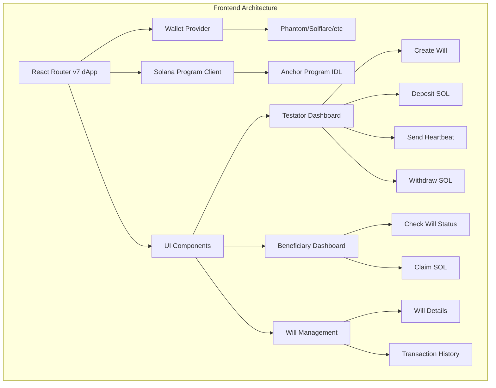
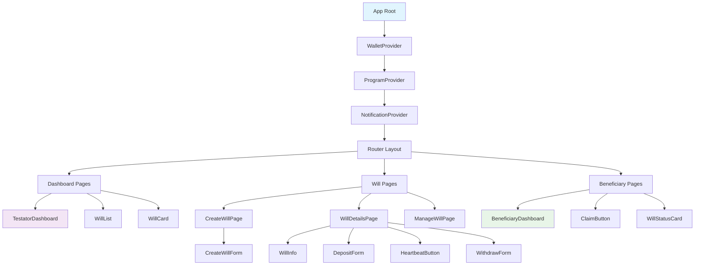

# Frontend Design & Architecture

Dokumentasi lengkap rancangan frontend untuk aplikasi Wasiat Online - crypto inheritance dApp built with React Router v7.

## 📋 Overview

Frontend dApp yang memungkinkan users untuk:

- **Testator (Pewasiat)**: Membuat will, deposit SOL, send heartbeat, withdraw SOL
- **Beneficiary (Penerima Manfaat)**: Check will status, claim SOL setelah triggered

## 🏗️ System Architecture



## 📁 Folder Structure

```
app/
├── components/          # Reusable UI components
│   ├── ui/             # Basic UI components (buttons, inputs, etc.)
│   │   ├── button.tsx
│   │   ├── input.tsx
│   │   ├── card.tsx
│   │   ├── dialog.tsx
│   │   ├── toast.tsx
│   │   ├── tabs.tsx
│   │   ├── progress.tsx
│   │   └── badge.tsx
│   ├── wallet/         # Wallet connection components
│   │   ├── wallet-button.tsx
│   │   ├── wallet-multi-button.tsx
│   │   └── wallet-status.tsx
│   ├── will/           # Will-specific components
│   │   ├── will-card.tsx
│   │   ├── create-will-form.tsx
│   │   ├── deposit-form.tsx
│   │   ├── heartbeat-button.tsx
│   │   ├── claim-button.tsx
│   │   ├── withdraw-form.tsx
│   │   └── sol-amount-input.tsx
│   ├── transaction/    # Transaction components
│   │   ├── tx-status.tsx
│   │   ├── tx-history.tsx
│   │   └── tx-confirmation.tsx
│   ├── landing/        # Landing page components
│   │   ├── hero-section.tsx
│   │   ├── features-section.tsx
│   │   ├── how-it-works-section.tsx
│   │   ├── cta-section.tsx
│   │   └── testimonials-section.tsx
│   └── layout/         # Layout components
│       ├── header.tsx
│       ├── footer.tsx
│       ├── sidebar.tsx
│       └── main-layout.tsx
├── hooks/              # Custom React hooks
│   ├── use-wallet.ts   # Wallet management
│   ├── use-program.ts  # Program interactions
│   ├── use-will.ts     # Will-specific operations
│   ├── use-transaction.ts # Transaction handling
│   └── use-pda.ts      # PDA derivation utilities
├── lib/                # Utility libraries
│   ├── solana/         # Solana-related utilities
│   │   ├── connection.ts
│   │   ├── rpc.ts
│   │   └── utils.ts
│   ├── anchor/         # Anchor client setup
│   │   ├── client.ts
│   │   ├── idl.ts
│   │   └── pda.ts
│   └── utils/          # General utilities
│       ├── format.ts
│       ├── validation.ts
│       └── constants.ts
├── providers/          # Context providers
│   ├── wallet-provider.tsx
│   ├── program-provider.tsx
│   └── notification-provider.tsx
├── routes/             # React Router pages
│   ├── _index.tsx      # Landing page
│   ├── about.tsx       # About page (how it works)
│   ├── features.tsx    # Features page
│   ├── dashboard/      # Dashboard pages
│   │   ├── testator.tsx
│   │   └── beneficiary.tsx
│   ├── will/           # Will management pages
│   │   ├── create.tsx
│   │   ├── $id.tsx     # Will details [id]
│   │   └── manage.tsx
│   └── beneficiary/    # Beneficiary pages
│       ├── check.tsx
│       └── claim.tsx
├── types/              # TypeScript definitions
│   ├── solana.ts       # Solana types
│   ├── will.ts         # Will types
│   ├── ui.ts           # UI types
│   └── transaction.ts  # Transaction types
└── styles/             # Styling files
    ├── globals.css
    └── components.css
```

## 🎨 UI Component Library

### Selected: **shadcn/ui + Tailwind CSS**

**Alasan:**

- ✅ Copy-paste components - Full ownership
- ✅ Highly customizable dengan Tailwind
- ✅ Accessible (built on Radix UI)
- ✅ Modern React patterns
- ✅ Small bundle size
- ✅ Perfect untuk crypto dApps

### Dependencies:

```json
{
  "dependencies": {
    // React Router v7
    "@react-router/node": "^7.7.1",
    "@react-router/serve": "^7.7.1",
    "react": "^19.1.0",
    "react-dom": "^19.1.0",
    "react-router": "^7.7.1",

    // Solana & Anchor
    "@coral-xyz/anchor": "^0.30.1",
    "@solana/web3.js": "^1.95.4",
    "@solana/wallet-adapter-base": "^0.9.23",
    "@solana/wallet-adapter-react": "^0.15.35",
    "@solana/wallet-adapter-react-ui": "^0.9.35",
    "@solana/wallet-adapter-wallets": "^0.19.32",

    // UI Components (shadcn/ui dependencies)
    "@radix-ui/react-slot": "^1.1.1",
    "@radix-ui/react-toast": "^1.2.2",
    "@radix-ui/react-dialog": "^1.1.2",
    "@radix-ui/react-dropdown-menu": "^2.1.2",
    "@radix-ui/react-tabs": "^1.1.1",
    "@radix-ui/react-progress": "^1.1.1",
    "class-variance-authority": "^0.7.1",
    "tailwind-merge": "^2.5.4",

    // Icons & Utils
    "lucide-react": "^0.453.0",
    "clsx": "^2.1.1",
    "react-hot-toast": "^2.4.1",

    // Animations for Landing Page
    "framer-motion": "^11.11.17",

    // Utilities
    "bignumber.js": "^9.1.2",
    "date-fns": "^4.1.0"
  }
}
```

## 🎯 Component Hierarchy



## 🗃️ State Management Strategy

### Context-based State Management:

```typescript
// 1. Wallet State (Global)
interface WalletState {
  wallet: WalletContextState;
  connected: boolean;
  publicKey: PublicKey | null;
  balance: number;
}

// 2. Program State (Global)
interface ProgramState {
  program: Program<WasiatOnline> | null;
  connection: Connection;
  config: GlobalConfig | null;
}

// 3. Will State (Per-component)
interface WillState {
  wills: Will[];
  currentWill: Will | null;
  loading: boolean;
  error: string | null;
}

// 4. Transaction State (Global)
interface TransactionState {
  pending: string[];
  confirmed: string[];
  failed: string[];
}
```

### Custom Hooks Strategy:

```typescript
// Wallet management
const useWallet = () => {
  // Connection, balance, account info
};

// Program interactions
const useProgram = () => {
  // IDL loading, RPC calls, account fetching
};

// Will-specific operations
const useWill = (testator?: PublicKey) => {
  // CRUD operations untuk will
  // fetchWills, createWill, depositSOL, etc.
};

// Transaction handling
const useTransaction = () => {
  // Send transactions, track status, handle errors
};
```

## 🔐 Wallet Integration

### Supported Wallets:

- **Phantom** (Primary)
- **Solflare**
- **Backpack**
- **Glow**

### Integration Flow:

```typescript
// WalletProvider setup
const supportedWallets = [
  new PhantomWalletAdapter(),
  new SolflareWalletAdapter(),
  new BackpackWalletAdapter(),
  new GlowWalletAdapter(),
];

// Network configuration
const network = WalletAdapterNetwork.Devnet; // atau Mainnet
const endpoint = clusterApiUrl(network);
```

### Security Considerations:

1. **Transaction Signing**: Semua operasi membutuhkan user approval
2. **PDA Verification**: Validate semua derived addresses
3. **Amount Validation**: Client-side validation sebelum transaction
4. **Error Handling**: Comprehensive error messages untuk user

## 📝 Type Definitions

### Core Types (`app/types/`):

```typescript
// types/will.ts
export interface Will {
  testator: PublicKey;
  beneficiary: PublicKey;
  vault: PublicKey;
  heartbeatPeriod: number;
  status: WillStatus;
  createdAt: number;
  lastHeartbeat: number;
  triggerAt: number | null;
  bump: number;
  vaultBump: number;
}

export enum WillStatus {
  Created = 0,
  Active = 1,
  Triggered = 2,
  Claimed = 3,
  Withdrawn = 4,
}

// types/solana.ts
export interface TransactionResult {
  signature: string;
  success: boolean;
  error?: string;
}

export interface PDAAccounts {
  will: PublicKey;
  vault: PublicKey;
  config: PublicKey;
  feeVault: PublicKey;
}

// types/transaction.ts
export interface TransactionStatus {
  signature: string;
  status: "pending" | "confirmed" | "failed";
  timestamp: number;
  error?: string;
}

// types/ui.ts
export interface WillCardProps {
  will: Will;
  onHeartbeat?: () => void;
  onDeposit?: () => void;
  onWithdraw?: () => void;
  onClaim?: () => void;
}
```

## 🎯 User Journey & Pages

### 🌟 **Landing Page Journey**:

1. **Hero Section** → Value proposition & primary CTAs
2. **Features Section** → Key benefits (Aman, Otomatis, Efisien)
3. **How It Works** → Step-by-step explanation
4. **Call to Action** → Connect wallet & get started

### 👤 **Testator Journey** (Pewasiat):

1. **Landing** (`/`) → Learn about Wasiat Online
2. **Connect Wallet** → Authentication via wallet adapter
3. **Dashboard** (`/dashboard/testator`) → Overview wills yang sudah dibuat
4. **Create Will** (`/will/create`) → Form buat will baru
5. **Will Details** (`/will/[id]`) → Manage will (deposit, heartbeat, withdraw)

### 👥 **Beneficiary Journey** (Penerima Manfaat):

1. **Landing** (`/`) → Understand the inheritance process
2. **Connect Wallet** → Authentication via wallet adapter
3. **Check Status** (`/beneficiary/check`) → Input will address atau scan QR
4. **Will Status** (`/will/[id]`) → Lihat detail will
5. **Claim Assets** (`/beneficiary/claim`) → Klaim jika sudah triggered

## 🌟 Landing Page Design

### Hero Section

```typescript
interface HeroSectionProps {
  title: "Wasiat Online — Crypto Inheritance Vault";
  subtitle: "Standar baru yang aman, transparan, dan terotomatisasi untuk pewarisan aset digital di blockchain";
  ctaPrimary: "Mulai Buat Wasiat";
  ctaSecondary: "Pelajari Lebih Lanjut";
  backgroundImage?: string;
}
```

**Key Elements:**

- 🎯 **Value Proposition** yang jelas
- 🔒 **Trust indicators** (security, transparency)
- 📱 **Primary CTA** untuk create will
- 📚 **Secondary CTA** untuk learn more
- 🎨 **Hero image/animation** showing inheritance flow

### Features Section

```typescript
const features = [
  {
    icon: "🔒",
    title: "Aman",
    description:
      "Pengguna memegang kendali penuh atas private key, aset diamankan oleh smart contract",
    details: ["Private key control", "Smart contract security", "Audited code"],
  },
  {
    icon: "🤖",
    title: "Otomatis",
    description:
      "Transfer aset terjadi otomatis berdasarkan aturan, tanpa perantara mahal",
    details: ["Automated triggers", "No intermediaries", "Instant execution"],
  },
  {
    icon: "⚡",
    title: "Efisien & Terjangkau",
    description:
      "Dibangun di Solana dengan biaya transaksi murah dan proses hampir seketika",
    details: ["Low fees", "Fast transactions", "Solana powered"],
  },
];
```

### How It Works Section

```typescript
const steps = [
  {
    step: 1,
    title: "Buat Wasiat",
    description: "Tentukan penerima manfaat dan periode heartbeat",
    icon: "📝",
    action: "create_will",
  },
  {
    step: 2,
    title: "Setor Aset",
    description: "Transfer SOL, SPL Token, atau NFT ke vault aman",
    icon: "💰",
    action: "deposit_assets",
  },
  {
    step: 3,
    title: "Kirim Heartbeat",
    description: "Konfirmasi aktivitas secara berkala untuk reset timer",
    icon: "💓",
    action: "send_heartbeat",
  },
  {
    step: 4,
    title: "Automatic Trigger",
    description: "Sistem otomatis mengaktifkan wasiat jika heartbeat berhenti",
    icon: "🤖",
    action: "auto_trigger",
  },
  {
    step: 5,
    title: "Klaim Aset",
    description: "Penerima manfaat dapat mengklaim aset dengan mudah",
    icon: "🎯",
    action: "claim_assets",
  },
];
```

### CTA Section

```typescript
interface CTASectionProps {
  title: "Mulai Amankan Warisan Digital Anda";
  description: "Bergabunglah dengan ratusan pengguna yang telah mempercayai Wasiat Online";
  primaryCTA: "Buat Wasiat Sekarang";
  secondaryCTA: "Lihat Demo";
  stats: {
    totalWills: "500+";
    totalValue: "$1M+";
    successRate: "99.9%";
  };
}
```

### Social Proof Section

```typescript
const testimonials = [
  {
    name: "Ahmad Reza",
    role: "Crypto Investor",
    content:
      "Wasiat Online memberikan ketenangan pikiran. Saya tahu aset crypto saya aman untuk keluarga.",
    avatar: "/avatars/user1.jpg",
  },
  {
    name: "Sarah Chen",
    role: "DeFi Enthusiast",
    content:
      "Proses yang sangat mudah dan transparan. Interface yang user-friendly!",
    avatar: "/avatars/user2.jpg",
  },
];
```

### Navigation & Header

```typescript
interface HeaderProps {
  logo: string;
  navigation: [
    { label: "Beranda"; href: "/" },
    { label: "Cara Kerja"; href: "/about" },
    { label: "Fitur"; href: "/features" },
    { label: "Dashboard"; href: "/dashboard" }
  ];
  wallet: {
    connected: boolean;
    address?: string;
    onConnect: () => void;
    onDisconnect: () => void;
  };
}
```

### Footer

```typescript
interface FooterProps {
  sections: [
    {
      title: "Produk";
      links: ["Buat Wasiat", "Dashboard", "Cara Kerja"];
    },
    {
      title: "Bantuan";
      links: ["FAQ", "Dokumentasi", "Kontak"];
    },
    {
      title: "Legal";
      links: ["Terms of Service", "Privacy Policy", "Disclaimer"];
    }
  ];
  social: ["Twitter", "Discord", "GitHub"];
  copyright: "© 2025 Wasiat Online. All rights reserved.";
}
```

## 🎨 Design System

### Color Palette:

```typescript
const colors = {
  primary: {
    50: "#f0f9ff",
    500: "#3b82f6", // Blue untuk trust & security
    600: "#2563eb",
    900: "#1e3a8a",
  },
  success: {
    50: "#f0fdf4",
    500: "#10b981", // Green untuk successful operations
    600: "#059669",
  },
  warning: {
    50: "#fffbeb",
    500: "#f59e0b", // Orange untuk warnings
    600: "#d97706",
  },
  danger: {
    50: "#fef2f2",
    500: "#ef4444", // Red untuk critical actions
    600: "#dc2626",
  },
  neutral: {
    50: "#f9fafb",
    100: "#f3f4f6",
    500: "#6b7280",
    900: "#111827",
  },
};
```

### Typography:

```typescript
const typography = {
  fontFamily: {
    sans: ["Inter", "system-ui", "sans-serif"],
    mono: ["JetBrains Mono", "monospace"],
  },
  fontSize: {
    xs: "0.75rem",
    sm: "0.875rem",
    base: "1rem",
    lg: "1.125rem",
    xl: "1.25rem",
    "2xl": "1.5rem",
    "3xl": "1.875rem",
  },
};
```

## 🚀 Implementation Phases

### **Phase 1: Core Infrastructure**

1. ✅ Setup Wallet Provider & Program Client
2. ✅ Basic routing dengan React Router v7
3. ✅ Core UI components (Button, Input, Card)
4. ✅ Layout structure & navigation
5. ✅ Landing page dengan Hero, Features, How It Works
6. ✅ Responsive header & footer

### **Phase 2: Testator Features**

1. ✅ Create Will functionality
2. ✅ Deposit SOL form & transaction
3. ✅ Send Heartbeat button
4. ✅ Withdraw SOL functionality
5. ✅ Will dashboard & list

### **Phase 3: Beneficiary Features**

1. ✅ Check will status page
2. ✅ Claim SOL functionality
3. ✅ Beneficiary dashboard

### **Phase 4: Enhancements**

1. ✅ Transaction history & status tracking
2. ✅ Better UX/UI polish
3. ✅ Comprehensive error handling
4. ✅ Loading states & skeletons
5. ✅ Mobile responsiveness

## 🎨 UI/UX Design Principles

1. **Simple & Clean**: Fokus pada functionality, bukan hiasan
2. **Mobile-First**: Responsive design untuk semua device
3. **Clear CTAs**: Button dan action yang jelas untuk crypto operations
4. **Status Indicators**: Visual feedback untuk semua transaction states
5. **Error Handling**: User-friendly error messages untuk blockchain errors
6. **Loading States**: Skeleton screens dan progress indicators
7. **Trust Building**: Professional design untuk financial application
8. **Accessibility**: WCAG compliant untuk inclusive design

## 📱 Responsive Design Strategy

### Breakpoints:

```css
/* Mobile First */
sm: '640px',   /* Small tablets */
md: '768px',   /* Tablets */
lg: '1024px',  /* Laptops */
xl: '1280px',  /* Desktops */
2xl: '1536px'  /* Large screens */
```

### Key Components Responsive Behavior:

- **WillCard**: Stack vertically on mobile, grid on desktop
- **Forms**: Single column on mobile, two-column on desktop
- **Dashboard**: Collapsible sidebar on mobile
- **Transaction History**: Horizontal scroll on mobile

## 🔒 Security Best Practices

### Frontend Security:

1. **Input Validation**: Client-side validation untuk semua forms
2. **Amount Parsing**: Safe BigNumber handling untuk SOL amounts
3. **PDA Verification**: Validate derived addresses sebelum transactions
4. **Transaction Simulation**: Preview transactions sebelum signing
5. **Error Sanitization**: Tidak expose sensitive data di error messages

### User Education:

1. **Transaction Confirmations**: Clear explanation sebelum signing
2. **Fee Disclosure**: Transparent fee breakdown
3. **Status Updates**: Real-time transaction status
4. **Security Tips**: Educated users tentang wallet security

## 📊 Performance Optimization

### Bundle Optimization:

1. **Tree Shaking**: Import hanya komponen yang dibutuhkan
2. **Code Splitting**: Lazy loading untuk routes
3. **Asset Optimization**: Optimized images dan icons
4. **CDN**: Static assets served via CDN

### Runtime Performance:

1. **Memoization**: React.memo untuk expensive components
2. **Virtual Scrolling**: Untuk large transaction lists
3. **Debounced Inputs**: Prevent excessive API calls
4. **Connection Pooling**: Efficient RPC connections

## 🧪 Testing Strategy

### Unit Testing:

- Custom hooks testing dengan React Testing Library
- Component testing untuk critical flows
- Utility functions testing

### Integration Testing:

- Wallet connection flows
- Transaction submission & confirmation
- Error handling scenarios

### E2E Testing:

- Complete user journeys (create will → deposit → heartbeat → claim)
- Cross-browser compatibility
- Mobile responsiveness

## TODO

- ✅ Install semua dependencies yang diperlukan dengan pnpm
- ✅ Setup Tailwind CSS dan shadcn/ui components
- ✅ Buat struktur folder sesuai rancangan
- ✅ Implementasi WalletProvider, ProgramProvider, NotificationProvider
- ✅ Buat Header, Footer, dan MainLayout components
- ✅ Implementasi landing page dengan Hero, Features, How It Works sections
- ✅ Setup React Router v7 dengan semua routes
- ✅ Buat basic UI components (Button, Input, Card, Dialog, etc)
- ✅ Setup wallet adapter dan wallet connection components - Works but with minor buffer warnings
- ✅ Setup Anchor program client dan PDA utilities
- ✅ Buat custom hooks (useWallet, useProgram, useWill, useTransaction)
- ✅ Implementasi Will-specific components (WillCard, CreateWillForm, etc)
- ✅ Implementasi Create Will
- ✅ Implementasi Dashboard
- Implementasi Details Will
- Implementasi Deposit SOL
- Implementasi Send Heartbeat
- Implementasi Withdraw SOL
- Implementasi Check Will Status dan Claim SOL
- Implementasi transaction status tracking dan error handling
- ✅ Pastikan semua components responsive untuk mobile
- Tambahkan loading states dan skeleton screens
- Comprehensive error handling untuk blockchain operations
- Testing end-to-end flows dan debugging
- Polish UI/UX, animations, dan final touches
