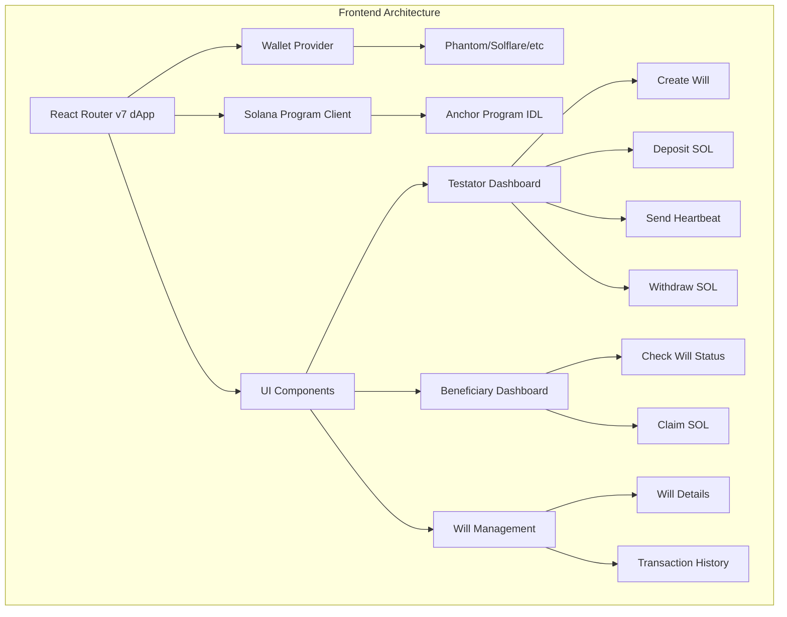
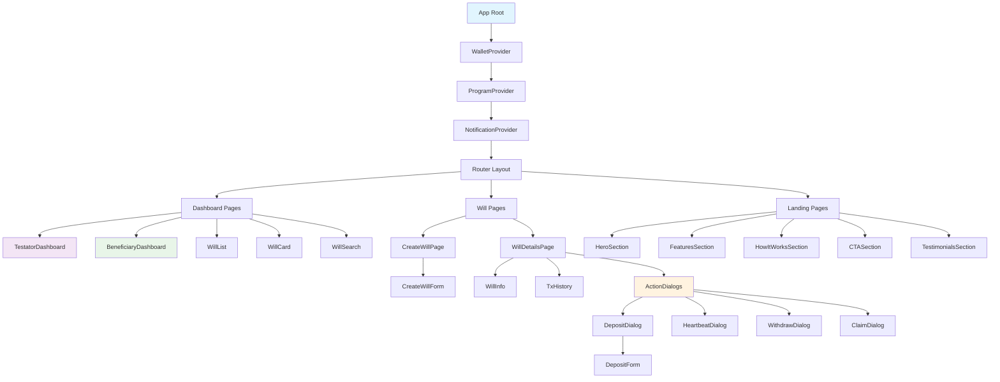

# Frontend Design & Architecture

Complete frontend design documentation for the Online Will application - a crypto inheritance dApp built with React Router v7.

## 📋 Overview

A frontend dApp that allows users to:

- **Testator**: Create a will, deposit SOL, send a heartbeat, withdraw SOL
- **Beneficiary**: Check will status, claim SOL after it is triggered

## 🏗️ System Architecture


```mermaid
graph TB
    subgraph "Frontend Architecture"
        A[React Router v7 dApp] --> B[Wallet Provider]
        A --> C[Solana Program Client]
        A --> D[UI Components]

        B --> E[Phantom/Solflare/etc]
        C --> F[Anchor Program IDL]
        D --> G[Testator Dashboard]
        D --> H[Beneficiary Dashboard]
        D --> I[Will Management]

        G --> J[Create Will]
        G --> K[Deposit SOL]
        G --> L[Send Heartbeat]
        G --> M[Withdraw SOL]

        H --> N[Check Will Status]
        H --> O[Claim SOL]

        I --> P[Will Details]
        I --> Q[Transaction History]
    end
```

## 📁 Folder Structure

```
app/
├── components/         # Reusable UI components
│   ├── ui/             # Basic UI components (buttons, inputs, etc.)
│   │   ├── button.tsx
│   │   ├── input.tsx
│   │   ├── card.tsx
│   │   ├── dialog.tsx
│   │   ├── toast.tsx
│   │   ├── tabs.tsx
│   │   ├── progress.tsx
│   │   └── badge.tsx
│   ├── wallet/         # Wallet connection components
│   │   ├── wallet-button.tsx
│   │   ├── wallet-multi-button.tsx
│   │   └── wallet-status.tsx
│   ├── will/           # Will-specific components
│   │   ├── will-card.tsx
│   │   ├── will-list.tsx
│   │   ├── will-search.tsx
│   │   ├── create-will-form.tsx
│   │   ├── deposit-form.tsx
│   │   └── dialogs/     # Action dialogs
│   │       ├── deposit-dialog.tsx
│   │       ├── heartbeat-dialog.tsx
│   │       ├── withdraw-dialog.tsx
│   │       └── claim-dialog.tsx
│   ├── transaction/    # Transaction components
│   │   ├── tx-status.tsx
│   │   ├── tx-history.tsx
│   │   └── tx-confirmation.tsx
│   ├── landing/        # Landing page components
│   │   ├── hero-section.tsx
│   │   ├── features-section.tsx
│   │   ├── how-it-works-section.tsx
│   │   ├── cta-section.tsx
│   │   └── testimonials-section.tsx
│   └── layout/         # Layout components
│       ├── header.tsx
│       ├── footer.tsx
│       ├── sidebar.tsx
│       └── main-layout.tsx
├── hooks/              # Custom React hooks
│   ├── use-wallet.ts   # Wallet management
│   ├── use-program.ts  # Program interactions
│   ├── use-will.ts     # Will-specific operations
│   ├── use-transaction.ts # Transaction handling
│   └── use-pda.ts      # PDA derivation utilities
├── lib/                # Utility libraries
│   ├── solana/         # Solana-related utilities
│   │   ├── connection.ts
│   │   ├── rpc.ts
│   │   └── utils.ts
│   ├── anchor/         # Anchor client setup
│   │   ├── client.ts
│   │   ├── idl.ts
│   │   └── pda.ts
│   └── utils/          # General utilities
│       ├── format.ts
│       ├── validation.ts
│       └── constants.ts
├── providers/          # Context providers
│   ├── wallet-provider.tsx
│   ├── program-provider.tsx
│   └── notification-provider.tsx
├── routes/             # React Router pages
│   ├── _index.tsx      # Landing page
│   ├── about.tsx       # About page (how it works)
│   ├── features.tsx    # Features page
│   ├── dashboard/      # Dashboard pages
│   │   ├── testator.tsx
│   │   └── beneficiary.tsx
│   ├── will/           # Will management pages
│   │   ├── create.tsx
│   │   ├── $id.tsx     # Will details [id]
│   │   └── manage.tsx
│   └── beneficiary/    # Beneficiary pages
│       ├── check.tsx
│       └── claim.tsx
├── types/              # TypeScript definitions
│   ├── solana.ts       # Solana types
│   ├── will.ts         # Will types
│   ├── ui.ts           # UI types
│   └── transaction.ts  # Transaction types
└── styles/             # Styling files
    ├── globals.css
    └── components.css
```

## 🎨 UI Component Library

### Selected: **shadcn/ui + Tailwind CSS**

**Reason:**

- Copy-paste components - Full ownership
- Highly customizable dengan Tailwind
- Accessible (built on Radix UI)
- Modern React patterns
- Small bundle size
- Perfect untuk crypto dApps

### Dependencies:

```json
{
  "dependencies": {
    // React Router v7
    "@react-router/node": "^7.7.1",
    "@react-router/serve": "^7.7.1",
    "react": "^19.1.0",
    "react-dom": "^19.1.0",
    "react-router": "^7.7.1",

    // Solana & Anchor
    "@coral-xyz/anchor": "^0.30.1",
    "@solana/web3.js": "^1.95.4",
    "@solana/wallet-adapter-base": "^0.9.23",
    "@solana/wallet-adapter-react": "^0.15.35",
    "@solana/wallet-adapter-react-ui": "^0.9.35",
    "@solana/wallet-adapter-wallets": "^0.19.32",

    // UI Components (shadcn/ui dependencies)
    "@radix-ui/react-slot": "^1.1.1",
    "@radix-ui/react-toast": "^1.2.2",
    "@radix-ui/react-dialog": "^1.1.2",
    "@radix-ui/react-dropdown-menu": "^2.1.2",
    "@radix-ui/react-tabs": "^1.1.1",
    "@radix-ui/react-progress": "^1.1.1",
    "class-variance-authority": "^0.7.1",
    "tailwind-merge": "^2.5.4",

    // Icons & Utils
    "lucide-react": "^0.453.0",
    "clsx": "^2.1.1",
    "react-hot-toast": "^2.4.1",

    // Animations for Landing Page
    "framer-motion": "^11.11.17",

    // Utilities
    "bignumber.js": "^9.1.2",
    "date-fns": "^4.1.0"
  }
}
```

## 🎯 Component Hierarchy


```mermaid
graph TD
    A[App Root] --> B[WalletProvider]
    B --> C[ProgramProvider]
    C --> D[NotificationProvider]
    D --> E[Router Layout]

    E --> F[Dashboard Pages]
    E --> G[Will Pages]
    E --> H[Landing Pages]

    F --> I[TestatorDashboard]
    F --> J[BeneficiaryDashboard]
    F --> K[WillList]
    F --> L[WillCard]
    F --> M[WillSearch]

    G --> N[CreateWillPage]
    G --> O[WillDetailsPage]
    
    N --> P[CreateWillForm]
    O --> Q[WillInfo]
    O --> R[TxHistory]
    O --> S[ActionDialogs]
    
    S --> T[DepositDialog]
    S --> U[HeartbeatDialog]
    S --> V[WithdrawDialog]
    S --> W[ClaimDialog]
    
    T --> X[DepositForm]
    
    H --> Y[HeroSection]
    H --> Z[FeaturesSection]
    H --> AA[HowItWorksSection]
    H --> BB[CTASection]
    H --> CC[TestimonialsSection]

    style A fill:#e1f5fe
    style I fill:#f3e5f5
    style J fill:#e8f5e8
    style S fill:#fff3e0
```

## 🗃️ State Management Strategy

### Context-based State Management:

```typescript
// 1. Wallet State (Global)
interface WalletState {
  wallet: WalletContextState;
  connected: boolean;
  publicKey: PublicKey | null;
  balance: number;
}

// 2. Program State (Global)
interface ProgramState {
  program: Program<WasiatOnline> | null;
  connection: Connection;
  config: GlobalConfig | null;
}

// 3. Will State (Per-component)
interface WillState {
  wills: Will[];
  currentWill: Will | null;
  loading: boolean;
  error: string | null;
}

// 4. Transaction State (Global)
interface TransactionState {
  pending: string[];
  confirmed: string[];
  failed: string[];
}
```

### Custom Hooks Strategy:

```typescript
// Wallet management
const useWallet = () => {
  // Connection, balance, account info, user role detection
};

// Single will operations
const useWill = (testator?: PublicKey, beneficiary?: PublicKey, willAddress?: PublicKey) => {
  // Single will CRUD operations
  // createWill, fetchWill, depositSOL, sendHeartbeat, withdrawSOL, claimSOL
};

// Multiple wills operations
const useWills = () => {
  // Multiple wills operations
  // fetchWills, getWillsByStatus, testatorWills, beneficiaryWills, stats
};

// Will search operations
const useWillSearch = () => {
  // Search specific will by address
  // searchWill, isValidSolanaAddress, clearSearch
};

// Transaction handling
const useTransaction = () => {
  // Send transactions, track status, handle errors
};
```

## 🔐 Wallet Integration

### Supported Wallets:

- **Phantom** (Primary)
- **Solflare**
- **Backpack**
- **Glow**

### Integration Flow:

```typescript
// WalletProvider setup
const supportedWallets = [
  new PhantomWalletAdapter(),
  new SolflareWalletAdapter(),
  new BackpackWalletAdapter(),
  new GlowWalletAdapter(),
];

// Network configuration
const network = WalletAdapterNetwork.Devnet; // atau Mainnet
const endpoint = clusterApiUrl(network);
```

### Security Considerations:

1. **Transaction Signing**: All operations require user approval
2. **PDA Verification**: Validate all derived addresses
3. **Amount Validation**: Client-side validation before the transaction
4. **Error Handling**: Comprehensive error messages for the user

## 📝 Type Definitions

### Core Types (`app/types/`):

```typescript
// types/will.ts
export interface Will {
  address: PublicKey;
  testator: PublicKey;
  beneficiary: PublicKey;
  vault: PublicKey;
  heartbeatPeriod: number;
  status: WillStatus;
  createdAt: number;
  lastHeartbeat: number;
  triggerAt: number | null;
  bump: number;
  vaultBump: number;
}

export interface WillWithStatus extends Will {
  vaultBalance: number;
  isExpired: boolean;
  canHeartbeat: boolean;
  canWithdraw: boolean;
  canClaim: boolean;
}

export enum WillStatus {
  Created = 0,
  Active = 1,
  Triggered = 2,
  Claimed = 3,
  Withdrawn = 4,
}

// types/solana.ts
export interface PDAAccounts {
  will: PublicKey;
  vault: PublicKey;
  config: PublicKey;
  feeVault: PublicKey;
}

// types/transaction.ts
export interface TransactionStatus {
  signature: string;
  status: "pending" | "confirmed" | "failed";
  timestamp: number;
  error?: string;
}

// types/ui.ts
export interface WillCardProps {
  will: WillWithStatus;
  userRole: "testator" | "beneficiary" | "viewer";
  onDeposit?: () => void;
  onHeartbeat?: () => void;
  onWithdraw?: () => void;
  onClaim?: () => void;
  onViewDetails?: () => void;
}

export interface DialogProps {
  open: boolean;
  onOpenChange: (open: boolean) => void;
  will: WillWithStatus;
  onSuccess?: () => void;
  onConfirm?: () => Promise<{ success: boolean; signature?: string | null }>;
}
```

## 🎯 User Journey & Pages

### 🌟 **Landing Page Journey**:

1. **Hero Section** → Value proposition & primary CTAs
2. **Features Section** → Key benefits (Safe, Automatic, Efficient)
3. **How It Works** → Step-by-step explanation
4. **Call to Action** → Connect wallet & get started

### 👤 **Testator Journey** (Testator):

1. **Landing** (`/`) → Learn about Wills Online
2. **Connect Wallet** → Authentication via wallet adapter
3. **Dashboard** (`/dashboard/testator`) → Overview of created wills
4. **Create Will** (`/will/create`) → Form to create a new will
5. **Will Details** (`/will/[id]`) → Manage will (deposit, heartbeat, withdraw)

### 👥 **Beneficiary Journey** (Beneficiary):

1. **Landing** (`/`) → Understand the inheritance process
2. **Connect Wallet** → Authentication via wallet adapter
3. **Check Status** (`/beneficiary/check`) → Input will address or scan QR
4. **Will Status** (`/will/[id]`) → View will details
5. **Claim Assets** (`/beneficiary/claim`) → Claim if it has been triggered

## 🌟 Landing Page Design

### Hero Section

```typescript
interface HeroSectionProps {
  title: "Online Wills — Crypto Inheritance Vault";
  subtitle: "A new, secure, transparent, and automated standard for digital asset inheritance on the blockchain";
  ctaPrimary: "Start Creating a Will";
  ctaSecondary: "Learn More";
  backgroundImage?: string;
}
```

**Key Elements:**

- 🎯 Clear **Value Proposition**
- 🔒 **Trust indicators** (security, transparency)
- 📱 **Primary CTA** for create will
- 📚 **Secondary CTA** to learn more
- 🎨 **Hero image/animation** showing inheritance flow

## 🎨 Design System

### Color Palette:

```typescript
const colors = {
  primary: {
    50: "#f0f9ff",
    500: "#3b82f6", // Blue untuk trust & security
    600: "#2563eb",
    900: "#1e3a8a",
  },
  success: {
    50: "#f0fdf4",
    500: "#10b981", // Green untuk successful operations
    600: "#059669",
  },
  warning: {
    50: "#fffbeb",
    500: "#f59e0b", // Orange untuk warnings
    600: "#d97706",
  },
  danger: {
    50: "#fef2f2",
    500: "#ef4444", // Red untuk critical actions
    600: "#dc2626",
  },
  neutral: {
    50: "#f9fafb",
    100: "#f3f4f6",
    500: "#6b7280",
    900: "#111827",
  },
};
```

### Typography:

```typescript
const typography = {
  fontFamily: {
    sans: ["Inter", "system-ui", "sans-serif"],
    mono: ["JetBrains Mono", "monospace"],
  },
  fontSize: {
    xs: "0.75rem",
    sm: "0.875rem",
    base: "1rem",
    lg: "1.125rem",
    xl: "1.25rem",
    "2xl": "1.5rem",
    "3xl": "1.875rem",
  },
};
```

## 📱 Responsive Design Strategy

### Breakpoints:

```css
/* Mobile First */
sm: '640px',   /* Small tablets */
md: '768px',   /* Tablets */
lg: '1024px',  /* Laptops */
xl: '1280px',  /* Desktops */
2xl: '1536px'  /* Large screens */
```

### Key Components Responsive Behavior:

- **WillCard**: Stack vertically on mobile, grid on desktop
- **Forms**: Single column on mobile, two-column on desktop
- **Dashboard**: Collapsible sidebar on mobile
- **Transaction History**: Horizontal scroll on mobile

## 🔒 Security Best Practices

### Frontend Security:

1. **Input Validation**: Client-side validation untuk semua forms
2. **Amount Parsing**: Safe BigNumber handling untuk SOL amounts
3. **PDA Verification**: Validate derived addresses sebelum transactions
4. **Transaction Simulation**: Preview transactions sebelum signing
5. **Error Sanitization**: Tidak expose sensitive data di error messages

## 📊 Performance Optimization

### Bundle Optimization:

1. **Tree Shaking**: Import hanya komponen yang dibutuhkan
2. **Code Splitting**: Lazy loading untuk routes
3. **Asset Optimization**: Optimized images dan icons
4. **CDN**: Static assets served via CDN

### Runtime Performance:

1. **Memoization**: React.memo untuk expensive components
2. **Virtual Scrolling**: Untuk large transaction lists
3. **Debounced Inputs**: Prevent excessive API calls
4. **Connection Pooling**: Efficient RPC connections
